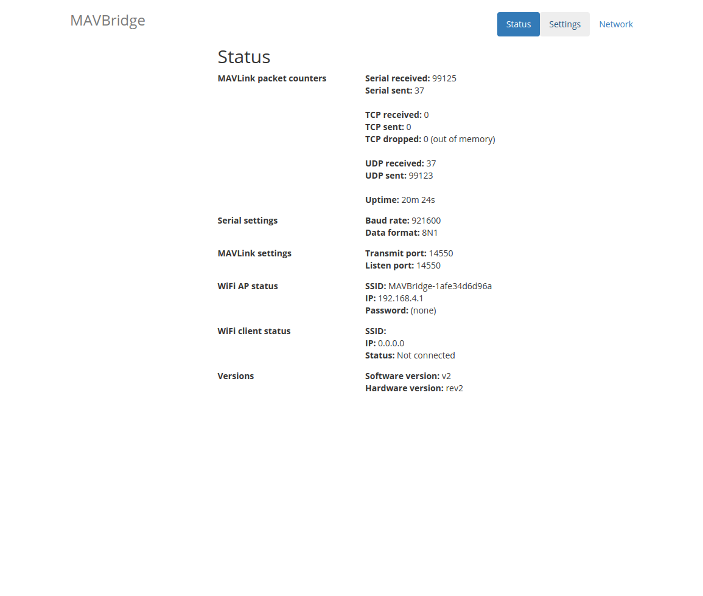
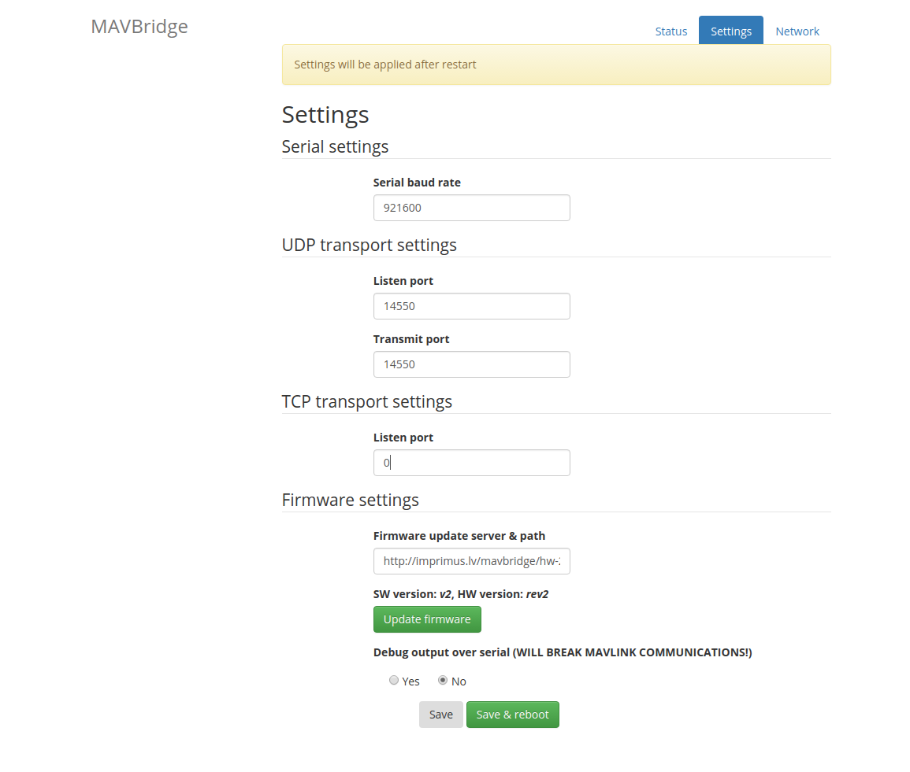

MAVBridge
------------------

MAVBridge is stand-alone ESP8266 based serial MAVLink <-> wireless bridge. It is compatible
with MAVLink v1.0 specification and 

Compatibility has been tested with:

* Pixhawk hardware (PX4 and ArduPilot flight stacks)
* APMPlanner
* MissionPlanner
* DroidTower
* qGroundcontrol
* MAVProxy

Device has built-in web interface for configuration and status.

At the moment, only UDP transport layer is supported. TCP support is
work-in-progress (functionality is there, but ESP runs out of RAM and crashes
when transmitting a lot of data).

As for performance- UDP has been successfully tested at 921600 baud rate and
almost 70 KiB/s data rate without packet-loss (depends on number of WiFi
networks around device , of course).

Configuration interface
--------------------------------

Index/status page:

Settings:

Building firmware
-------------------

Prerequisites for building:
* https://github.com/pfalcon/esp-open-sdk with Espressif IOT SDK 1.5.2
* Sming framework: https://github.com/SmingHub/Sming/releases/tag/2.1.0

Assuming the requirements above are satisfied, building is as simple as:

    cd firmware
    make

Hardware
-----------

Hardware is designed using Kicad and the design is available in hardware
folder.

Testing
--------------

Python scripts that automatically test performance and stability of the
MAVBridge are available in `throughput-test/`. Tests require pymavlink.
